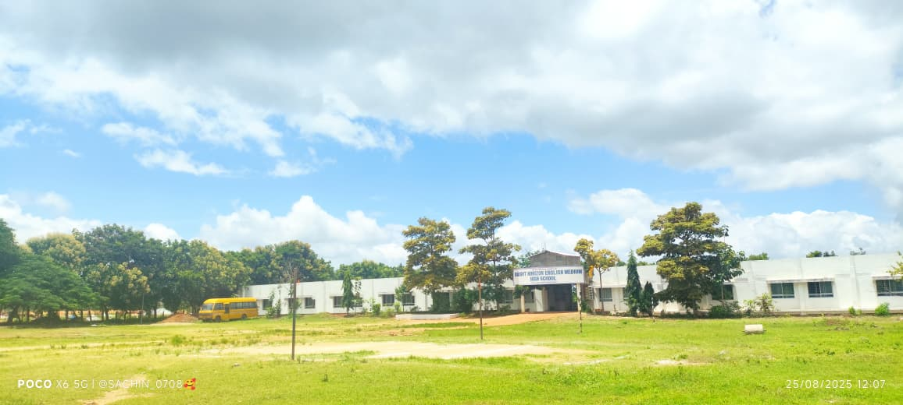
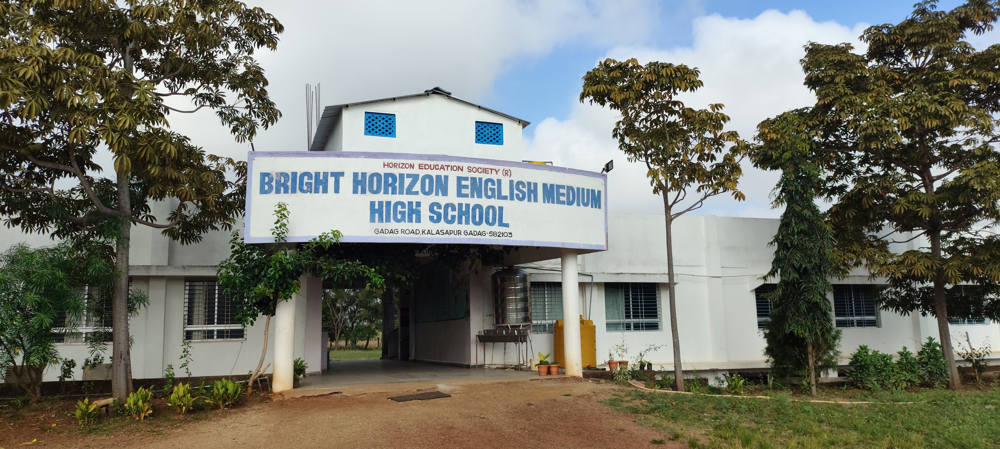
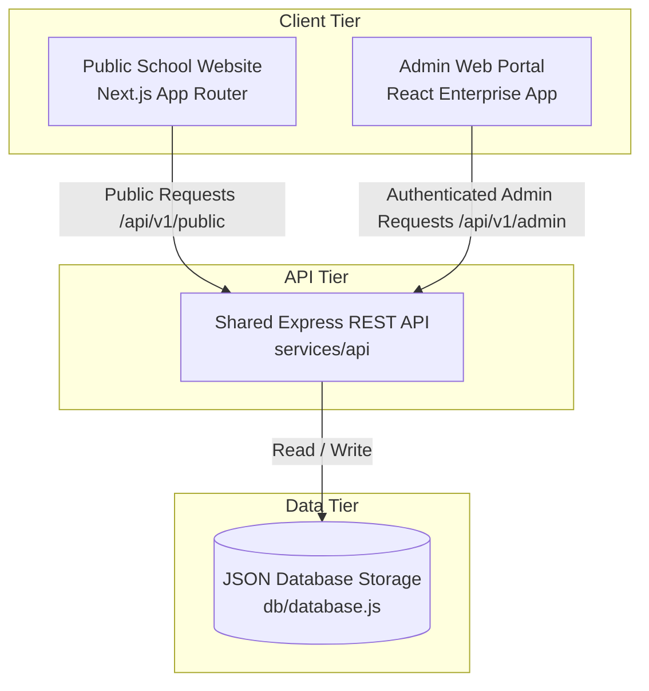
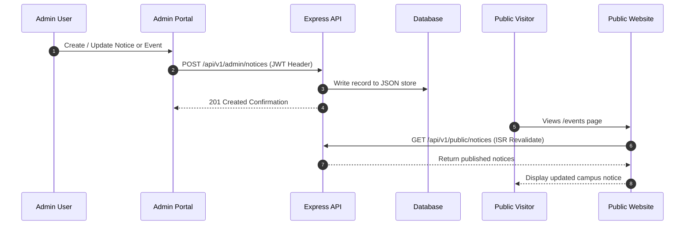

<p align="center">
  
</p>

<h1 align="center">Bright Horizon School</h1>

<p align="center">
  <strong>Modern Digital School Website & Enterprise Administration Platform</strong>
</p>

<p align="center">
  <a href="https://bright-horizon-school.vercel.app/">🌐 Live Website</a> •
  <a href="#-documentation-index">📚 Documentation</a> •
  <a href="#-architecture">🏗️ Architecture</a> •
  <a href="http://localhost:3001/login">🛡️ Admin Portal</a>
</p>

<p align="center">
  
</p>

<p align="center">
  
  
  
  
  
  
</p>

---

## 📋 Table of Contents

- [Overview](#-overview)
- [Project Status](#-project-status)
- [Key Features](#-key-features)
- [Feature Status Matrix](#-feature-status-matrix)
- [Campus Showcase](#-campus-showcase--visual-gallery)
- [Architecture](#-architecture)
- [Project Structure](#-project-structure)
- [Public Website](#-public-website)
- [Admin Portal](#-admin-portal)
- [CMS Workflow](#-cms-workflow)
- [Technology Stack](#-technology-stack)
- [Installation \& Setup](#-installation--setup)
- [Environment Variables](#-environment-variables)
- [Available Scripts](#-available-scripts)
- [API Architecture](#-api-architecture)
- [Security](#-security)
- [Performance](#-performance)
- [Responsive Design](#-responsive-design)
- [SEO \& Accessibility](#-seo--accessibility)
- [Testing \& Quality](#-testing--quality)
- [Deployment](#-deployment)
- [Documentation Index](#-documentation-index)
- [Roadmap](#-roadmap)
- [Contributing](#-contributing)
- [License](#-license)

---

## 🏫 Overview

**Bright Horizon School** is a full-stack digital school management platform composed of an interactive public-facing school website, a separate enterprise administration portal, and a shared backend REST API service.

- **Public School Website**: Built with **Next.js App Router**, **TypeScript**, and **Tailwind CSS**. It provides parents, prospective students, and community visitors with comprehensive information regarding academics, admissions, faculty profiles, facilities, events, news, photo galleries, downloads, and an interactive AI School Assistant.
- **Separate Admin Portal**: A dedicated web application running on an isolated domain for authorized school administrators to manage student records, faculty rosters, staff, admissions enquiries, fee structures, examination timetables, and CMS publication.

> [!IMPORTANT]
> **Strict System Boundaries**:
> There are **NO Student, Teacher, Parent, or multi-role login portals** on the public school website. The ONLY authenticated access point is the isolated **Admin Portal**. Educators displayed on the public website are published public faculty profiles.

---

## 🟢 Project Status

- **Status**: 🟢 **Production Ready**
- **Public Website URL**: [https://bright-horizon-school.vercel.app/](https://bright-horizon-school.vercel.app/)
- **Admin Portal URL**: `http://localhost:3001/login` (Internal Admin Application)
- **Architecture**: Decoupled Monorepo (`apps/website`, `apps/admin`, `services/api`, `packages/*`)

---

## ✨ Key Features

### 🌐 Public Website (`apps/website`)
- **Interactive Hero & 3D Backdrop**: Features a dynamic **Vanta.js Birds 3D animation canvas** with customizable dark background parameters (`#0d1117`).
- **Academic Stream Details**: Full overview of Primary (Grades 1-5), Middle (Grades 6-8), and Secondary/Senior High (Grades 9-12) CBSE curricula.
- **Distinguished Faculty Directory**: Searchable public directory with department filter chips, qualification details, and subject expertise.
- **Online Admission Enquiry Form**: Zod-validated enquiry submission powered by **React Hook Form**.
- **Campus Facilities**: Detailed breakdown of STEM Robotics Hub, Science & Biotech Labs, Digital Library, Sports Complex, and GPS-monitored fleet transport.
- **Campus Bulletin & News**: Real-time ticker for urgent notices, upcoming calendar events, and published news articles.
- **Media Gallery with Lightbox**: Photo/video albums categorized by event with full-screen lightbox modal.
- **AI School Assistant Chatbot**: Floating AI modal providing answers to visitor queries regarding admissions, fees, and school timings.

### 🛡️ Enterprise Admin Portal (`apps/admin`)
- **Admin Authentication**: JWT-based authentication with protected route guards and automatic session expiry.
- **Analytics Dashboard**: High-level metrics for student counts, faculty statistics, enquiry conversion rates, and revenue overview.
- **Student & Faculty Management**: Full CRUD capability for student records, enrollment status, and public faculty visibility toggles.
- **Admissions Review System**: Review, process, approve, or reject incoming admission applications.
- **Fee Management**: Term fee structure configuration, payment tracking, and receipt generation.
- **CMS Management**: Control live published content on the public website (notices, news, events, gallery albums, achievements, downloads).
- **Audit Logging**: Comprehensive system audit log tracking administrator actions and timestamps.

---

## 📊 Feature Status Matrix

| Feature Module | Public Website | Admin Portal | Implementation Status |
| :--- | :---: | :---: | :---: |
| **Hero Banner & 3D Vanta Background** | ✅ | — | ✅ Completed |
| **About Us & Core Values** | ✅ | — | ✅ Completed |
| **Academic Streams (Grades 1-12)** | ✅ | ✅ | ✅ Completed |
| **Faculty Profiles Directory** | ✅ (Public) | ✅ (CRUD) | ✅ Completed |
| **Campus Facilities Showcase** | ✅ | — | ✅ Completed |
| **Online Admission Form (Zod)** | ✅ (Submit) | ✅ (Review) | ✅ Completed |
| **Academic Fee Table** | ✅ | ✅ | ✅ Completed |
| **Events & Urgent Notices CMS** | ✅ (View) | ✅ (Publish) | ✅ Completed |
| **Photo Gallery & Lightbox** | ✅ | ✅ | ✅ Completed |
| **Student Records & Attendance** | — | ✅ | ✅ Completed |
| **Examinations & Timetable** | — | ✅ | ✅ Completed |
| **AI School Assistant Chatbot** | ✅ | — | ✅ Completed |
| **Admin Authentication (JWT)** | — | ✅ | ✅ Completed |

---

## 📷 Campus Showcase & Visual Gallery

<p align="center">
  
  
  
</p>

---

## 🏗️ Architecture

The platform follows a decoupled monorepo architecture:



---

## 📁 Project Structure

```text
bright-horizon-school/
├── apps/
│   ├── website/                      # Next.js App Router Public School Website
│   │   ├── src/
│   │   │   ├── app/                  # Route handlers: layout, page, about, academics, admissions, etc.
│   │   │   ├── components/           # Shared UI & Vanta 3D backdrop components
│   │   │   ├── features/             # Modular feature domains (admissions, faculty, contact, chatbot)
│   │   │   ├── services/             # REST API Client (api.ts)
│   │   │   ├── constants/            # Route & School constants
│   │   │   ├── config/               # Site configuration
│   │   │   └── types/                # TypeScript DTOs
│   │   ├── public/                   # Static images, logo, icons
│   │   └── package.json
│   │
│   └── admin/                        # School Administration Portal Application
│       ├── src/
│       │   ├── app/                  # Admin page components
│       │   ├── components/           # Sidebar, Header, Tables, Dialogs
│       │   └── features/             # auth, dashboard, students, teachers, cms
│       └── package.json
│
├── packages/
│   ├── shared-types/                 # Shared TypeScript interfaces
│   ├── shared-utils/                 # Currency, date formatters, string helpers
│   └── api-client/                   # Centralized HTTP request client
│
├── services/
│   └── api/                          # Express REST API Server & Database
│
├── docs/                             # Architecture Reports & Technical Guides
├── .env.example                      # Environment variables template
├── package.json                      # Monorepo root package.json
└── README.md
```

---

## 🌐 Public Website

- **Framework**: Next.js (App Router) + React + TypeScript + Tailwind CSS
- **Design Tokens**: Preserved `#0d1117` dark background, `#ff4df0` / `#c91cff` neon glowing buttons, and glassmorphic cards (`backdrop-filter: blur(12px)`).
- **Client & Server Component Separation**: Server-rendered layouts for SEO with interactive client components (`VantaBirdsBg`, `AdmissionForm`, `ContactForm`, `ChatbotModal`).
- **Validation**: Form inputs validated using **Zod** and **React Hook Form**.

---

## 🛡️ Admin Portal

- **Purpose**: Internal administrative dashboard accessible only to authenticated staff.
- **Authentication**: JWT tokens stored securely in memory / local storage with explicit header authorization.
- **Protected Routes**: Redirects unauthenticated access directly to `/login`.
- **System Audit Log**: Every database mutation records the administrator ID, action, resource, and timestamp.

---

## 🔄 CMS Workflow



---

## 🛠️ Technology Stack

| Layer | Technology | Description |
| :--- | :--- | :--- |
| **Frontend Framework** | **Next.js 14** | App Router, Server Components & ISR |
| **Admin Framework** | **React 18** | Enterprise Single Page Application |
| **Programming Language** | **TypeScript 5.3** | Strict type checking & shared DTO interfaces |
| **Styling & CSS** | **Tailwind CSS** | Utility-first CSS + Custom Glassmorphism Variables |
| **Animation Engine** | **Three.js & Vanta.js** | 3D Birds dark canvas animation backdrop |
| **Form Management** | **React Hook Form** | High-performance client form state |
| **Form Validation** | **Zod 3.22** | Strict schema validation |
| **Iconography** | **Lucide React** | Clean vector icons |
| **Backend API** | **Node.js & Express** | RESTful endpoints for public and admin operations |
| **Deployment** | **Vercel** | Edge Network deployment for public website |

---

## ⚙️ Installation & Setup

### Prerequisites
- Node.js >= `18.0.0`
- npm >= `9.0.0`

### Step-by-Step Instructions

1. **Clone the Repository**:
   ```bash
   git clone https://github.com/Sachinxcode-01/brighthorizonschool.git
   cd brighthorizonschool
   ```

2. **Install Workspace Dependencies**:
   ```bash
   npm install
   ```

3. **Configure Environment Variables**:
   ```bash
   cp .env.example .env
   ```

4. **Start All Services in Development**:
   ```bash
   npm run dev
   ```
   This concurrently runs:
   - **Express API Backend**: `http://localhost:5000`
   - **Public Website**: `http://localhost:3000`
   - **Admin Portal**: `http://localhost:3001`

---

## 🔑 Environment Variables

The project uses `.env.example` to define required variables:

| Variable | Required | Default | Description |
| :--- | :---: | :--- | :--- |
| `NEXT_PUBLIC_API_URL` | Yes | `http://localhost:5000/api/v1/public` | Public Website API endpoint |
| `NEXT_PUBLIC_ADMIN_URL` | Yes | `http://localhost:3001/login` | External Admin Login URL |
| `VITE_API_URL` | Yes | `http://localhost:5000/api/v1/admin` | Admin Application API endpoint |
| `PORT` | Yes | `5000` | Express API server port |
| `JWT_SECRET` | Yes | `your_jwt_secret_key_here` | Secret key for JWT signing |

---

## 📜 Available Scripts

Root `package.json` provides scripts to manage all workspace applications:

| Command | Description |
| :--- | :--- |
| `npm run dev` | Concurrently start API backend, public website, and admin portal |
| `npm run dev:website` | Start Public Website dev server (`http://localhost:3000`) |
| `npm run dev:admin` | Start Admin Portal dev server (`http://localhost:3001`) |
| `npm run dev:api` | Start Express API server (`http://localhost:5000`) |
| `npm run build` | Compile production builds for all applications |
| `npm run build:website` | Build production Next.js Public Website |
| `npm run type-check` | Run TypeScript verification (`tsc --noEmit`) |

---

## 🔌 API Architecture

### Public Endpoints (`/api/v1/public/*`)
- `GET /api/v1/public/site-content`: Get main site content and principal message.
- `GET /api/v1/public/faculty`: Fetch public educator profiles.
- `GET /api/v1/public/notices`: Fetch active school notices.
- `GET /api/v1/public/events`: Fetch upcoming school events.
- `GET /api/v1/public/gallery`: Fetch published photo albums.
- `POST /api/v1/public/enquiry`: Submit online admission enquiry.
- `POST /api/v1/public/contact`: Submit contact message.
- `POST /api/v1/public/ai-assistant`: Query AI School Assistant chatbot.

### Protected Admin Endpoints (`/api/v1/admin/*`)
- `POST /api/v1/admin/login`: Authenticate administrator.
- `GET /api/v1/admin/students`: Manage student records.
- `POST /api/v1/admin/cms/*`: Create/update live site content.

Detailed documentation is available in [docs/API.md](docs/API.md).

---

## 🔒 Security

- **Admin Authentication**: JWT authorization headers required for all `/api/v1/admin/*` endpoints.
- **Input Sanitization**: Zod schema validation prevents invalid payloads.
- **CORS Restrictions**: Express server limits origin domains.
- **Audit Logging**: Internal log file tracking administrative changes.

---

## ⚡ Performance

- **Next/Image**: Optimized image delivery using dynamic sizes and lazy loading.
- **Incremental Static Regeneration (ISR)**: Next.js revalidates public content every 60 seconds.
- **Code Splitting**: Dynamic imports for heavy 3D canvas libraries (Vanta / Three.js).

---

## 📱 Responsive Design

Tested and verified across key screen sizes:
- 📱 **Mobile**: 320px – 480px
- 📱 **Tablet**: 768px – 1024px
- 💻 **Desktop**: 1280px+

---

## ♿ SEO & Accessibility

- **Semantic HTML5**: `header`, `nav`, `main`, `section`, `article`, `footer`.
- **Next.js Metadata API**: OpenGraph tags, page titles, and meta descriptions.
- **Accessibility**: High contrast neon accents against dark backgrounds, keyboard navigation support, and `alt` text for images.

---

## 🧪 Testing & Quality

Run TypeScript verification across the codebase:
```bash
npm run type-check
```

---

## 🚀 Deployment

### Public Website Deployment (Vercel)
The public website is configured for seamless deployment on **Vercel**:
```bash
npm run build:website
```

---

## 📚 Documentation Index

- 📑 [Technology Migration Report](docs/MIGRATION.md)
- 🏗️ [Architecture Migration Report](docs/ARCHITECTURE_MIGRATION_REPORT.md)
- 📐 [System Architecture](docs/ARCHITECTURE.md)
- 📁 [Folder Structure Guide](docs/FOLDER_STRUCTURE.md)
- 🌐 [Public Website Specs](docs/PUBLIC_WEBSITE.md)
- 🛡️ [Admin Portal Specs](docs/ADMIN_PORTAL.md)
- 🔌 [REST API Reference](docs/API.md)
- 💾 [Database & Storage](docs/DATABASE.md)
- 🔒 [Security Architecture](docs/SECURITY.md)
- 💻 [Development Workflow Guide](docs/DEVELOPMENT.md)
- 🚀 [Deployment Guide](docs/DEPLOYMENT.md)

---

## 🗺️ Roadmap

### Completed ✅
- [x] Decoupled monorepo architecture setup
- [x] Next.js App Router migration with 100% design preservation
- [x] Vanta.js 3D Birds animation background integration
- [x] Feature module organization (`src/features/*`)
- [x] React Hook Form + Zod schema validation
- [x] Dedicated Admin Portal application

### Planned 📌
- [ ] Push notification service for urgent notices
- [ ] Advanced analytics charts for fee revenue trends

---

## 🤝 Contributing

1. Fork the Repository.
2. Create a Feature Branch (`git checkout -b feature/AmazingFeature`).
3. Commit your Changes (`git commit -m 'Add AmazingFeature'`).
4. Verify TypeScript (`npm run type-check`).
5. Push to the Branch (`git push origin feature/AmazingFeature`).
6. Open a Pull Request.

---

## 📄 License

This project is licensed under the **MIT License**.

---

<p align="center">
  Built with ❤️ for <strong>Bright Horizon School</strong>
</p>

<p align="center">
  <a href="#bright-horizon-school">Back to top ↑</a>
</p>