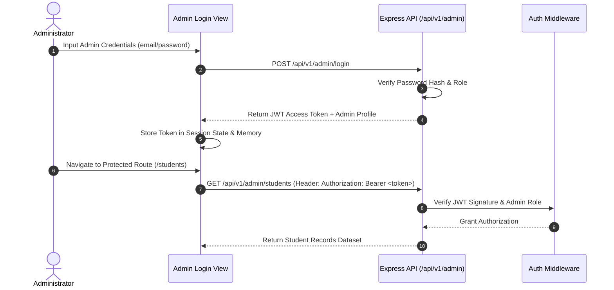

# Authentication & Authorization System - Bright Horizon School

## Core Architectural Boundary

> [!IMPORTANT]
> **Single Authentication Domain**:
> The ONLY privileged login allowed in the Bright Horizon School platform is **ADMIN LOGIN**.
> The Public Website (`apps/website`) has **ZERO Student, Parent, or Teacher login portals**.

```
Public School Website (bright-horizon-school.vercel.app)
├── No Login Forms
├── No Session Cookies
└── Read-Only Public Content Access

Admin Portal Application (admin.bright-horizon-school.com)
├── Isolated Domain
├── Admin Credentials Login (/login)
└── Protected Enterprise Management Routes
```

## Admin Authentication Flow



## Token Configuration & Security Standards
- **Token Type**: JSON Web Token (JWT)
- **Algorithm**: HS256
- **Expiration**: 8 hours (standard administrator shift)
- **Header Format**: `Authorization: Bearer <jwt_token>`
- **Role Verification**: Middleware validates `role === 'ADMIN'` on every protected request.
