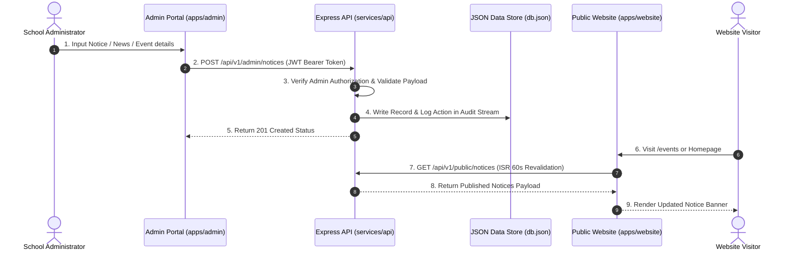

# CMS & Content Synchronization - Bright Horizon School

## Overview
The Content Management System (CMS) workflow connects the private **Admin Portal** to the **Public School Website** via the **Shared REST API Server**.

## Publishing Workflow

## Content Types Managed via CMS

1. **Urgent Notices**: Category, Title, Content, Priority Flag (`isImportant`), Publish Date.
2. **School Events**: Title, Description, Date, Time, Venue, Category, Header Image URL.
3. **News Articles**: Title, Content, Author, Image URL, Publish Date.
4. **Faculty Profiles**: Teacher Name, Designation, Department, Subject, Qualification, Experience, Public Visibility Toggle (`isPublic`).
5. **Photo & Video Gallery**: Album Title, Event Date, Category, Images Array (`url`, `caption`).
6. **Student & School Achievements**: Award Title, Recipient Name, Category, Year, Image URL, Description.
7. **Document Downloads**: Title, Category, File Size, File URL, Upload Date.
8. **Homepage & Site Content**: Hero Title, Hero Subtitle, Principal Name, Principal Message, Principal Photo URL, Core Educational Values.
